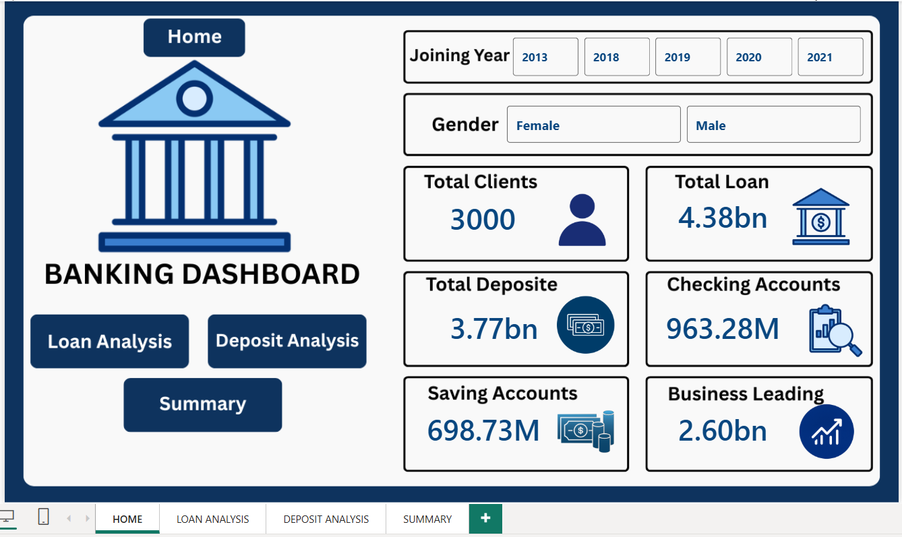
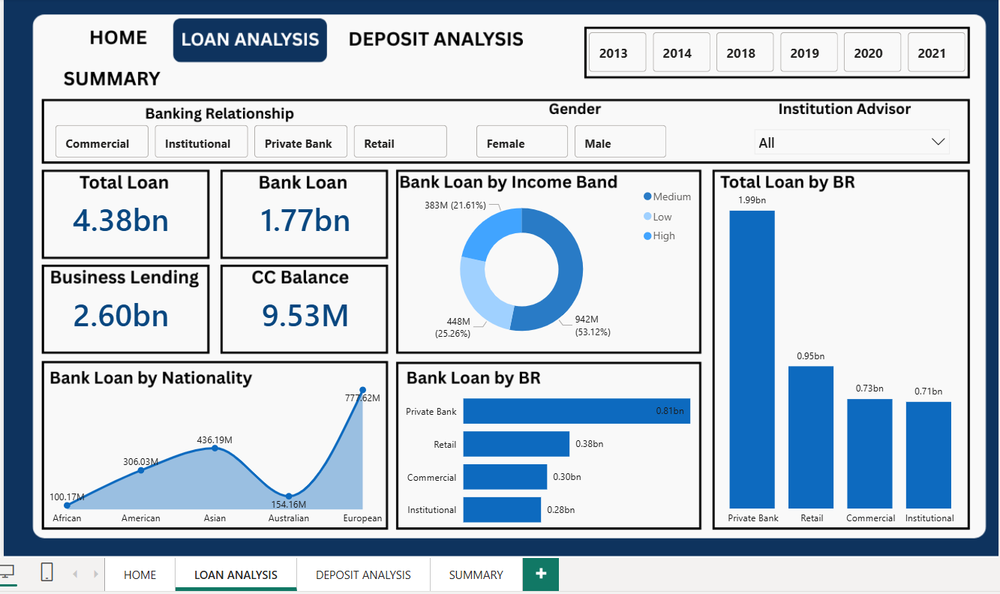
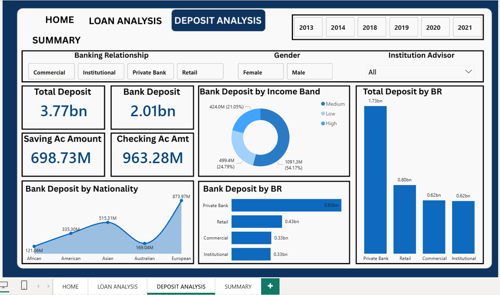
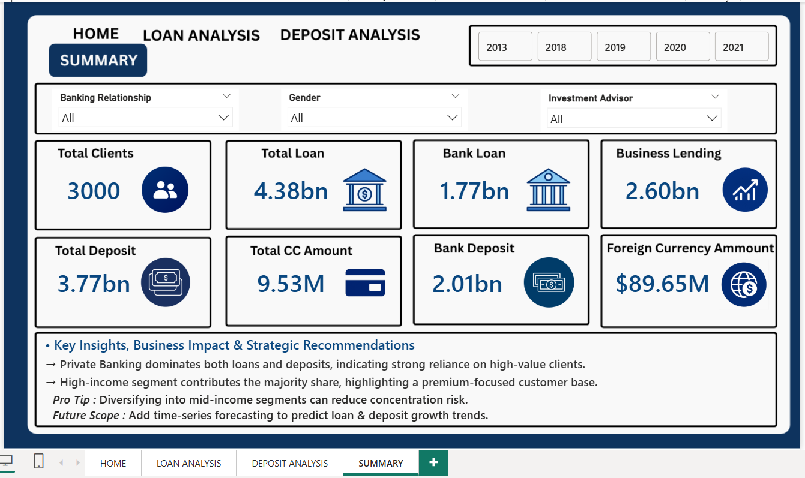

# Banking-Customer-Insights-Dashboard-PowerBI-
End-to-end Banking Dashboard built using SQL and Power BI to analyze customer demographics, deposits, loans, account balances, and key banking KPIs through interactive dashboards and business insights.
.
# 🏦 Banking Customer Insights Dashboard | Power BI + SQL

## 📌 Project Overview

This project is an end-to-end **Banking Analytics Dashboard** developed using **SQL** and **Power BI**. The dashboard transforms raw banking data into meaningful business insights by analyzing customer demographics, deposits, loans, banking relationships, income bands, and financial KPIs.

The dashboard enables decision-makers to monitor banking performance, identify profitable customer segments, and understand lending and deposit trends through interactive visualizations.

---

## 🛠️ Tools & Technologies

- Power BI
- SQL
- Power Query
- DAX
- Data Modeling
- Data Visualization

---

## 📊 Dashboard Pages

### 🏠 Home Dashboard

### Features

- Overall Banking KPI Summary
- Total Clients
- Total Loans
- Total Deposits
- Savings Accounts
- Checking Accounts
- Business Lending
- Interactive Year & Gender Filters
- Navigation Buttons

---

### 💳 Loan Analysis

### Analysis Performed

- Total Loan Distribution
- Bank Loan Amount
- Business Lending Analysis
- Credit Card Balance
- Loan Distribution by Income Band
- Loan Analysis by Banking Relationship
- Loan Distribution by Nationality
- Loan Comparison Across Banking Relationships
- Dynamic filtering using Year, Gender and Institution Advisor

### Key Insights

- Private Banking customers contribute the highest loan amount.
- High-income customers account for more than half of total loans.
- European customers have the highest loan value.
- Commercial and Institutional customers contribute comparatively lower loan amounts.

---

### 💰 Deposit Analysis

### Analysis Performed

- Total Deposits
- Bank Deposits
- Savings Account Amount
- Checking Account Amount
- Deposit Distribution by Income Band
- Deposit Analysis by Banking Relationship
- Deposit Distribution by Nationality
- Comparison of Deposits across Banking Relationships
- Interactive slicers for Year, Gender and Banking Relationship

### Key Insights

- Private Banking contributes the largest share of deposits.
- High-income customers hold the majority of deposits.
- European customers contribute the highest deposit amount.
- Retail Banking is the second-largest contributor after Private Banking.

---

### 📈 Executive Summary

### Dashboard Summary

The summary page consolidates the most important KPIs into a single business view.

#### KPIs Included

- Total Clients
- Total Loan
- Bank Loan
- Business Lending
- Total Deposit
- Bank Deposit
- Credit Card Amount
- Foreign Currency Amount

#### Business Insights

- Private Banking dominates both loans and deposits, indicating strong dependence on high-value customers.
- High-income customers generate the majority of banking business.
- Retail Banking represents a significant secondary revenue source.
- Customer segmentation reveals opportunities for expanding Commercial and Institutional banking.

#### Recommendations

- Diversify lending beyond Private Banking to reduce concentration risk.
- Increase focus on medium-income customers through targeted financial products.
- Develop strategies to improve Commercial and Institutional banking performance.
- Implement predictive analytics to forecast loan and deposit growth.
